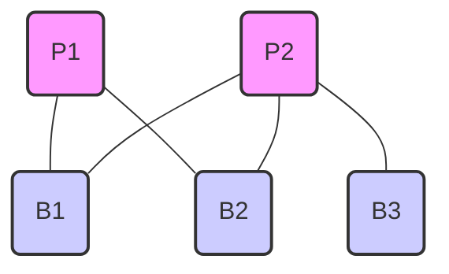
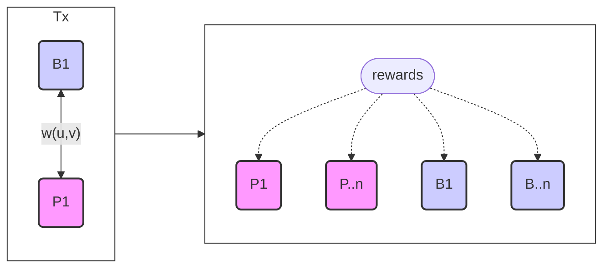
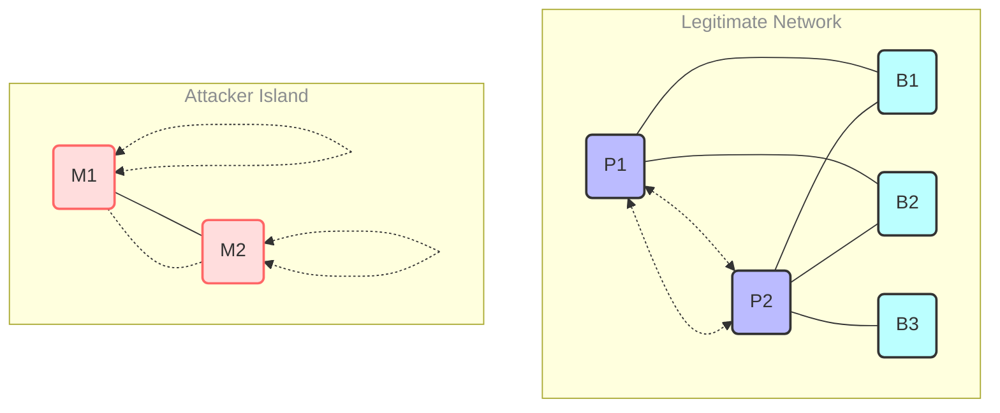
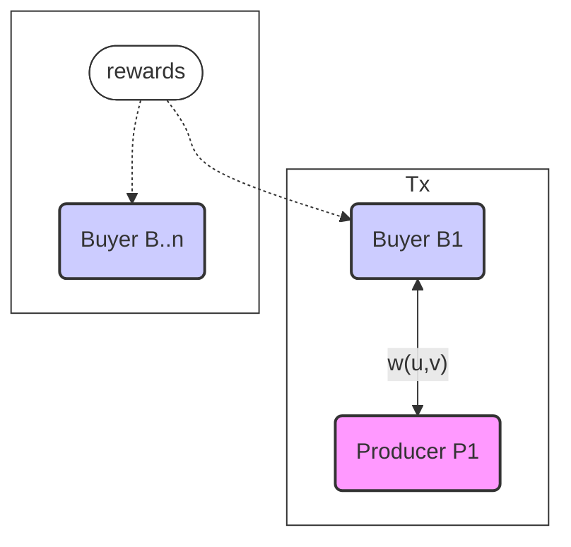
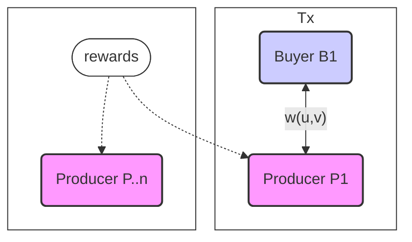
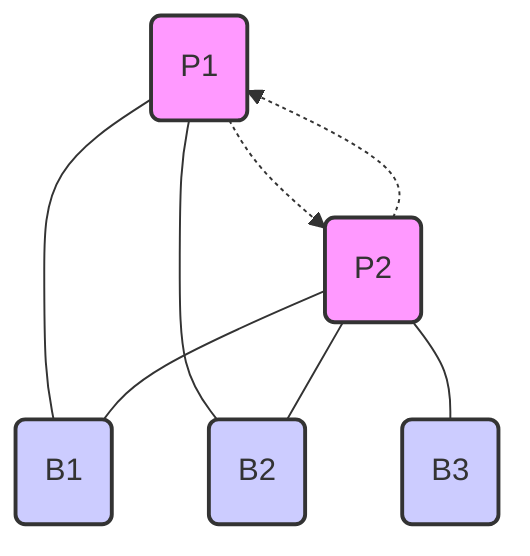
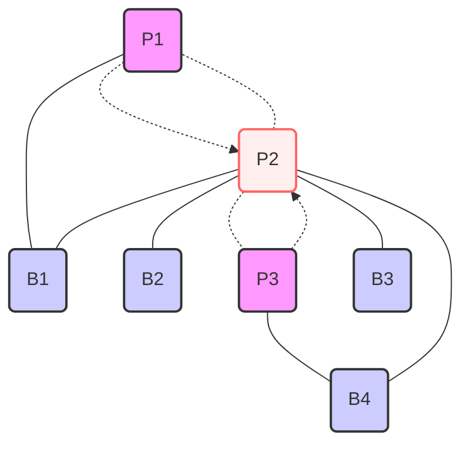

In this post, I propose a novel token design strategy that draws inspiration from one of the most successful algorithms in the history of the internet: PageRank[^1]. 

PageRank is an Eigenvector-based algorithm that focuses on *centrality* which is a fundamental measure in network theory that quantifies the importance or influence of a node within a network.

Eigenvector-based algorithms are well-suited to capture the quality and impact of a node's position in a network's topology, and are therefore a great method to distribute tokens in complex networks. 

> **Note:** If you are interested in the general concepts, you can find the original PageRank paper [here](http://infolab.stanford.edu/~backrub/google.html) which is a fun time lapse back to "idea-stage" Google

## Intro to PageRank
At its core, PageRank revolutionized the way we navigate the web by recognizing that not all links are created equal. A link from a highly influential page carries more weight than one from an obscure corner of the internet. This insight led to a recursive evaluation of importance, creating a robust ranking system that serves as the engine to perhaps the best business model in the last half-century.

This same principle – the notion of recursive influence – holds the key to designing optimal token distributions in complex cryptonetworks. By using centrality ranks as a foundation for token allocations, we can create a dynamical, self-optimizing network that:
1. Naturally aligns incentives with network growth
2. Resists manipulation and Sybil attacks
3. Dynamically adapts to evolving market conditions
4. Implicitly reward behaviors that strengthen network effects

## The Basic Idea
Any commercial network can be modeled as a bipartite graph that captures the economic relationships between producers and buyers, with edge weights signifying the historical transactions between the two nodes.

By modeling the network as a graph, we can design an economic system that dynamically adjusts token incentives based on the revealed preferences and pricing power of the participants.

The token rewards can be determined using a modified eigenvector centrality measure, which takes into account both the revenue generated by each node and its centrality in the network. This technique quantifies an individual node's contribution to the current state of the network, considering its economic impact and its role in facilitating transactions between other nodes.

The network can leverage the graph's structural properties to implement a token allocation mechanism that optimizes the distribution of rewards based on the temporal and economic characteristics of the transacting agents in the multi-sided market.

A simple definition of the graph can be $G = (U, V, E)$ representing producers $U$ and buyers $V$ as nodes, with weighted edges $E$ capturing transactions between them. Edge weights $w(u, v)$ track the producer's $u$ transactions with the buyer $v$.



|             | Buyer 1 (B1) | Buyer 2 (B2) | Buyer 3 (B3) |
|-------------|--------------|--------------|--------------|
| Producer 1 (P1) | w(U1, V1)    | w(U1, V2)    | w(U1, V3)    |
| Producer 2 (P2) | w(U2, V1)    | w(U2, V2)    | w(U2, V3)    |

With this graph we can optimize against a universal objective function:
- maximizing total number of transactions
- mazimizing total fees transacted
- maximizing connectivity of the entire network

**This single model contains the following properties:**
- The network naturally evolves towards optimal structures for value creation
- Early adopters and key contributors are rewarded proportional to their *influence* in sub-networks
- The system becomes increasingly resistant to manipulation as it grows
- Provides the ability to *propagate trust* and *reputation*
- The network can naturally adapt to optimize rewards across various stages of network maturity
- The split between supply and demand can self-optimize as the network learns the pricing power of the transacting parties

## Beyond Simple Incentives
Traditional approaches to token design might allocate tokens based on transaction volume, geography, predefined roles within a network, referrals etc. While these methods do drive certain behaviors, they fall short in maximally aligning incentives within a complex, interconnected network.

Centrality-based designs unlock a more nuanced, precise, and adaptive approach - recognizing that value in a network is not about individual actions, but a web of relationships and influence.

#### Network Maturity and Early Adopter Rewards
Many DePINs mint tokens based on a simple exponential decay model. Mining block rewards generates a large number of tokens per unit of work early as a bootstrapping incentive. Over time, rewards rapidly decrease.

This design has been successful at bootstrapping supply but today's DePIN's have a huge demand problem, leading to imbalanced services, potential token supply issues, and ultimately supply-side churn due to diminishing returns as the network matures.

By modeling a network as a graph, we can design incentives that are adaptive and dynamical such that we maximize the overall utility to *all users* across the network's adoption lifecycle.

Token rewards can scale gracefully based on the state of the graph and can be recursively re-balanced with consumer demand, creating a system that successfully bootstraps the network without creating undue harm to the treasury or future earning potential of suppliers.

By optimizing for connectivity in immature markets, EC maintains a healthy balance between growing supply and demand. 

**A distribution mechanism can look like this:**

where the value created from a net new transaction creates a block reward that can be redistributed to any number of currently active nodes on either the demand or supply side of the network, depending on the economic properties of this graph.



#### Sybil Resistance, Verifiability, and Security
As a network matures, connectivity becomes increasingly difficult and expensive to manufacture, making eigenvector-centrality an effective sybil resistance mechanism.

Producers aiming to increase their influence must generate real transactions with genuine buyers who also interact with other producers. If PageRank views centrality as a measure of recursive influence, we can view it as a measure of recursive trust.

##### The Island Effect
When a malicious actor attempts to create fake transactions, they form isolated clusters or "islands" within the network. "Islands" have limited connectivity to the rest of the network and are expensive to create.

Legitimate users are unlikely to engage with them. Consequently, malicious nodes exhibit low EC scores, as they lack the strong, organic connections to the rest of the network.

This island effect makes it difficult for attackers to artificially inflate their influence or rewards, as EC inherently favors nodes with high-quality, real connections.

##### Propagation of Trust 
In the absence of robust service-proofs to verify the legitimacy of transactions, a network becomes vulnerable to various game-theoretic challenges, including self-dealing and collusion risks.

> **A brief practical explanation of the problem of verifiability**
>
> As we explored the design space for real-world service-proofs, we identified a number of possible verification strategies for last-mile delivery networks. Specifically, a combination of location-proofs, randomized pin exchanges with drivers, and random driver assignment together provide a robust proof-of-delivery mechanism for the current state of delivery networks. This double-blind system ensures that neither the provider nor the customer can confidently predict or influence the matching process. If the provider and customer are known to be unique, cannot systematically predict the assignment of the third colluding party, and all three parties require cooperation to submit a valid service-proof then there is extremely low collusion risk in mature markets.
>
> However, even in the case of mobile food ordering, the majority of all orders are still pick up orders. Pick-up orders and in-store dining are much more difficult to verify. Because restaurants do not sell a commodity, provider assignment cannot be randomized. This makes it easy for a set of two cooperating attackers to collude and earn a block reward without doing the work required to justify the reward (in this case producing the food for the buyer). We could use a similar location-proof to verify that both parties are in the same location at the time of the transaction, but even if the customer is in the store of the restaurant, it is impossible to have a robust proof-of-work mechanism that verifies (with high confidence) that the service was performed.

##### A Spectrum of Verifiability
As described above, in the context of a peer-to-peer restaurant food delivery network, there are varying levels of verifiability across the two primary supported transaction types (pickup and delivery). 

This spectrum of verifiability presents a significant hurdle for the mass adoption of decentralized physical infrastructure services. Typical work-arounds either require a trusted third-party, expensive service proofs, or strict permissions / registration to participate. These restrictions are all limitations that limit the design space available to build truly robust, sustainable, and decentralized networks at a global scale.

**We might visualize a framework where all projects fall somewhere on this spectrum of proof availability.**

```
   Hard to Create/Expensive
           |
           |
    III    |    IV
           |
-----------+----------- Cheap/Expensive
           |
     II    |     I
           |
           |
  Easy to Create/Cheap
```

**Quadrant I: Easy to Create (weak-guarantee) and Cheap**  
Simple randomized pin exchanges: Users and drivers exchange simple PINs to verify or mutually attest to service completion.

**Quadrant II: Easy to Create (weak-guarantee) and Expensive**  
Basic location sharing: Sharing the user's location through GPS, which can be easily manipulated but is straightforward to implement.

**Quadrant III: Hard to Create (strong-guarantee) and Cheap**  
On-chain Reputation-based systems: take a long time to develop but can be cheap and robust at scale.

**Quadrant IV: Hard to Create (strong-guarantee) and Expensive**  
Advanced location proofs: ZkTLS with cell tower or trusted hardware. Either computationally expensive or requires hardware.

Networks trying to bootstrap adoption often face challenges when relying on verification methods that fall into Quadrant IV (Hard to Create and Expensive). These methods, while robust, can hinder growth due to their complexity and cost. Conversely, using methods from Quadrant I (Easy to Create and Cheap) may lead to increased vulnerability to attacks such as self-dealing and collusion.

Eigenvector Centrality (EC) rankings can help mitigate issues in each of these networks by propagating trust assumptions through the graph. In networks with weak or expensive service proofs, EC rankings become particularly valuable. The underlying assumption is that collusion becomes increasingly difficult as the number of colluding nodes increases.

For networks bootstrapping trust, EC rankings can help establish trust vectors for nodes through a combination of service proofs and identity sampling. As the network grows and trust is established, the reliance on expensive service-proofs can be gradually reduced with a dampening factor over time. 

By leveraging EC rankings, networks can strike a balance between security and costs depending on their needs. As trust propagates through the network, the need for expensive and complex verification methods decreases, enabling the network to scale more efficiently without compromising security.

##### Sampling Trust   
To ensure that the graph doesn't lose its security guarantees as new nodes enter the game, the network can randomly sample for service-proofs or service-approximations if proofs aren't available. If a node fails to provide their proofs, the network can slash the edge weights (tokens staked in the graph), along with those of their neighboring nodes. This localized penalty system encourages self-policing and reinforces the importance of maintaining genuine connections with real users.

By creating a verification system that can adapt to the specific requirements and constraints of different DePIN projects, network designers can expand the range of services that can be decentralized. This approach acknowledges a spectrum of verifiability and provides a path forward for networks that may not have access to hard or cost-effective service proofs.

##### Difficulty in Manufacturing Connectivity
Achieving a high EC score requires not only a large number of connections but also connections to other well-connected nodes. This property makes it challenging for malicious actors to manufacture high connectivity rankings, as they would need to establish links with reputable, central nodes in the network.

Legitimate, highly-connected nodes are more likely to scrutinize and avoid suspicious or low-quality nodes. As a result, attackers face significant hurdles to manipulate their EC scores.

In this example, the block rewards produced from legitimate actors are reinforcing. Malicious actors are losing fees per transaction and shuffling around rewards to themselves, making self-dealing unprofitable:



As the network expands, the computational cost and effort required to manipulate EC scores increases. Attackers would need to establish an ever-growing number of connections to keep pace with the network's organic growth, making it impractical and resource-intensive to maintain a significant influence to earn large rewards - making the entire network increasingly robust to attacks over time.

#### Generalizing to Various Networks
Adjustable fees allow markets to self-optimize token distributions across various commercial contexts. Nodes in the network can fine-tune to dynamically align incentives, eliminating the need for network designers to make naive assumptions about the unpredictable behavior of participants in different economic settings. 

Optimal token distributions are "*discovered*" based on the pricing power of producers in different sub-networks. This adaptive mechanism ensures that tokens are allocated in a way that reflects the true value of services provided, fostering a competitive and balanced network that reaches a comfortable equilibrium as the network matures.

In markets with unique, high-demand producers, most of the reward for a given transaction is likely to accrue to the producer. Conversely, in markets where producers sell goods with many substitutes, the reward will be distributed in favor of the buyer (the producer will use their rewards as marketing capital).

This adaptive incentive system ensures that the token economy remains responsive to changes in dynamic markets, and different networks automatically adapt without manual recalibration.

**Example Buyer Favored Market:**



**Example Producer Favored Market:**



#### Centrality as an Implicit Referral Mechanism
Centrality rankings implicitly capture what other networks attempt to achieve through imprecise mechanisms like referral rewards or marketing incentives. For example, Braintrust's connector program.[^2] 

In a graph, "referrals" are not enshrined as a concept; they are just the optimal strategy to maximize personal rewards. 

Users are therefore unknowingly participating in a complex, multi-agent optimization process where the optimal strategy is:
- Contribute as much revenue as possible
- Recruit your neighbors to contribute as much revenue as possible

Connectivity allows us to align the incentives of the individual agents in the network with those of the network's objective function. In practice, this results in a more mathematically precise referral mechanism. 

The aggregated behavior of countless self-interested actions drives behaviors that tend towards maximizing total network value. 

We hypothesize that the collective action of self-interested agents, each seeking to maximize their individual utility, will develop more effective solution concepts to maximize network value compared to a single centralized actor. Through the alignment of incentives, we aim to create a system that encourages fast, self-reinforcing network growth.

---

Simple example of a self-reinforcing game where P2 transactions benefit P1:



You can think of EC based networks as "outsourcing acquisition and retention".

## What are the Risks?
While centrality-based token economies offer an exciting new possibility for DePIN projects and cryptonetworks alike, there are a couple of risks to consider.

#### Potential for Centralization
If the distribution mechanism heavily favors highly connected nodes, it could lead to a disproportionate accumulation of tokens in the hands of a few influential actors. This centralization of power could make the system vulnerable to manipulation by these entities. To mitigate this risk, it's crucial to carefully design the network's monetary policy, taking into account potential tradeoffs.

If we over-emphasize connectivity, highly connected nodes can earn disproportionate rewards, which can lead to a concentration of power. In this example P2 is establishing too much power:



One approach to address this issue is implementing an inflationary monetary policy. By gradually increasing the token supply over time, the relative influence of today's powerful nodes can be diluted. This allows new entrants to compete more effectively and helps prevent the entrenchment of dominant players. However, it's important to strike a balance, as excessive inflation can also devalue token holdings and disincentivize participation.

#### Computational Complexity
Calculating eigenvector centrality involves diagonalizing a large matrix, which can become computationally demanding as the network grows and transaction volumes increase. The computational resources required to process these calculations may strain the network's capacity, potentially leading to slower transaction times and reduced efficiency.

To address this challenge, we are exploring various optimization techniques, like [this one](https://www.vldb.org/conf/2006/p415-xavier%20parreira.pdf).[^3] We are also exploring various sharding techniques, which involve partitioning the network into smaller, more manageable subgraphs. By dividing the computational workload across these shards, the network can process centrality calculations more efficiently, allowing for faster transaction processing and improved scalability. Luckily there is a tremendous amount of research in the literature about PageRank given it's importance in web2 contexts. As we make progress here, we will continue to share more here.

## Wrapping Up
Eigenvector-based cryptonetworks offer a unique set of generalizable properties that can be tuned to support a wide range of commercial networks. We think that this strategy captures the nuances of unpredictable economic behavior and could unlock a bunch of new cryptonetworks that either don't have verifiable service-proofs or have weak service-proofs. 

The set of techniques discussed in this article provide a rich set of new primitives that can overcome these restrictions across a [spectrum of verifiability](#a-spectrum-of-verifiability) which can help unlock a tremendous number of new use cases and catalyze mass adoption for the next generation of the internet.

Although there are some risks and serious research problems ahead, we think this proposal unlocks a rich new design space for DePIN and other applications. If you want to stay up to date on our advancements [follow me on twitter](https://twitter.com/mike_perhats).

This research originated from the work of [Matheus Venturyne Xavier Ferreira](https://sites.google.com/view/matheusvxf/bio), with support from our friends at the [CryptoEconLab](https://research.protocol.ai/groups/cryptoeconlab/).

## References
[^1]: [Original Google Paper](http://infolab.stanford.edu/~backrub/google.html)
[^2]: [Braintrust Whitepaper](https://www.usebraintrust.com/hubfs/%5BWhitepaper%5D%20Braintrust_The_Decentralized_Talent_Network_9_2_21.pdf)
[^3]: [Efficient PageRank Approximation](https://www.vldb.org/conf/2006/p415-xavier%20parreira.pdf)

